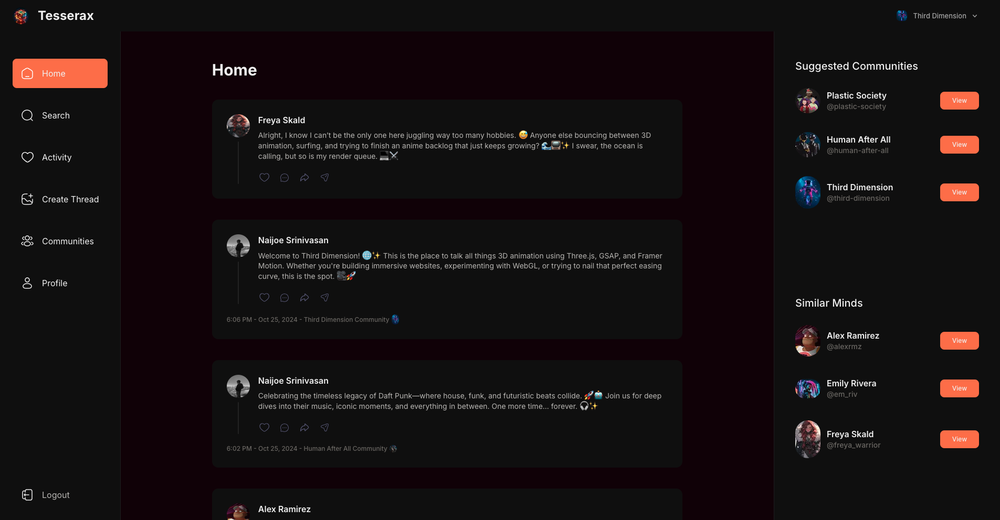

# Tesserax - Threads Clone Web App

Tesserax is a web application inspired by Threads, built using **Next.js**, **TypeScript**, **Shadcn UI**, **Tailwind CSS**, **MongoDB** and other modern technologies. The app enables users to create, share, and engage with posts in a seamless and modern interface. This project builds on concepts from a tutorial but was independently implemented with custom features and styling.

---


## Screenshots




## Features
- **Post Creation**: Create and publish posts with a clean and responsive interface.
- **User Engagement**: Like, comment, and interact with posts.
- **Dynamic Updates**: Real-time updates for posts and interactions using webhooks.
- **Authentication**: Seamless user authentication with Clerk.
- **Responsive Design**: A fully responsive UI built with Shadcn UI and Tailwind CSS for an optimized experience across devices.
- **Serverless Architecture**: Backend functionality implemented with serverless APIs.
- **Type Safety**: Leveraged TypeScript and Zod for robust type safety and validation.

---

## Tech Stack
- **Frontend**:
  - **Next.js**: React-based framework for server-side rendering and static site generation.
  - **TypeScript**: Adds type safety and improves code maintainability.
  - **Tailwind CSS**: Utility-first CSS framework for responsive and modern design.
  - **Shadcn UI**: Modern UI components library for building responsive designs.
  - **React Hook Form**: Simplifies form handling and validation.
- **Backend**:
  - **MongoDB**: NoSQL database for efficient data storage.
  - **Webhooks**: For real-time updates and asynchronous communication.
  - **Serverless APIs**: Scalable and efficient API handling with serverless architecture.
- **Validation**:
  - **Zod**: Schema declaration and validation for strong runtime data validation.
- **Authentication**:
  - **Clerk**: User authentication and management.

---

## Installation

1. Clone the repository:
   ```bash
   git clone https://github.com/naijoesrinivasan/tesserax.git
   cd tesserax
   ```
2. Install dependencies:
   ```bash
   npm Install
   ```
3. Create a .env.local file and configure environment variables:
   ```bash
   DATABASE_URL=<your_database_url>
   WEBHOOK_URL=<your_webhook_url>
   NEXT_PUBLIC_CLERK_FRONTEND_API=<your_clerk_frontend_api>
   CLERK_API_KEY=<your_clerk_api_key>
   ```
4. Run the development server:
   ```bash
   npm run dev
   ```
5. Open the app in your browser:
   ```bash
   http://localhost:3000
   ```


## Usage
- Launch the development server locally or deploy the app to a platform like Vercel.
- Post Creation:
  - Use the "New Post" button to create a post.
  - Add text content and publish it to the feed.
- Interactions:
  - Like and comment on posts in the feed.
  - View real-time updates to posts and interactions powered by webhooks.
- Responsive Design:
  - Access the app on various devices for a seamless experience.

## File Structure
- */components*: Reusable UI components for the application.
- */pages*: Routes and main views for the app.
- */styles*: Tailwind CSS configurations and global styles.
- */utils*: Helper functions for common tasks.
- */hooks*: Custom React hooks for managing state and data fetching.
- */lib*: Configurations and integrations for Clerk, MongoDB, and other services.


## Deployment

- Deploy to Vercel:
  - Connect your GitHub repository to Vercel.
  - Vercel will automatically build and deploy the application.
  - Set environment variables in Vercel for database, webhooks, and Clerk authentication.
- Access the deployed app via the generated URL.